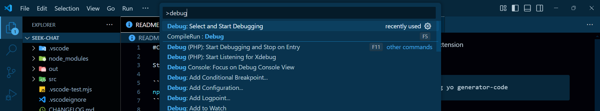
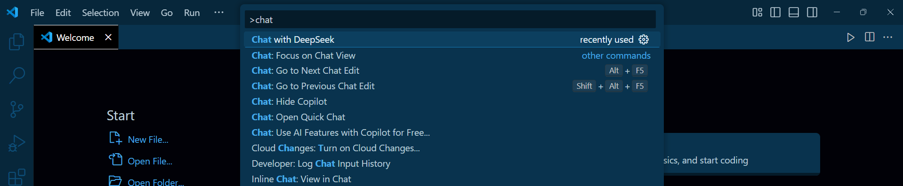
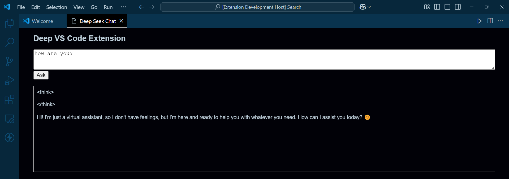

#Create VS Code Extension

Step 1

```bash
npm install -g yo generator-code
```

Step 2

```bash
 yo code
```

Step 3

```bash
ctrl + p
```

Step 4: select first option > Run Extension

```bash
> debug
```



Step 5: Open new Vs Code window > select Chat with DeepSeek



Step 6: chat with DeepSeek

